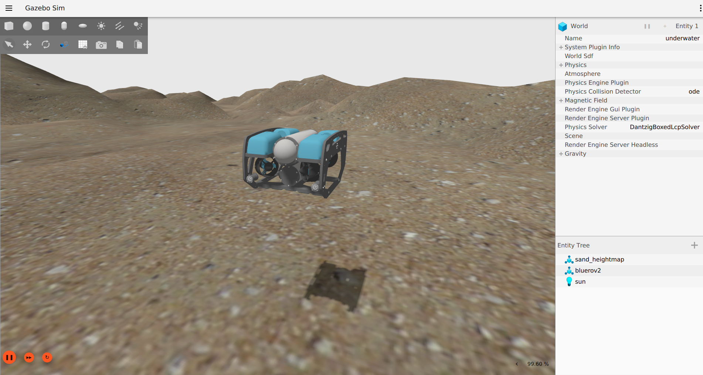

# BlueROV2 in Gazebo Garden

> Status: proof-of-concept, updated for Gazebo Garden binaries

This is a model of the BlueROV2, including support for both the base and heavy
configurations, that runs in Gazebo Garden. It uses the BuoyancyPlugin,
HydrodynamicsPlugin and ThrusterPlugin.

## Requirements

Please ensure that the following requirements have been met prior to installing the
project:

* [Gazebo Garden 7.1.0](https://gazebosim.org/docs/garden/install)
* [ardupilot_gazebo](https://github.com/ArduPilot/ardupilot_gazebo)
* [ArduSub and MAVProxy](https://ardupilot.org/dev/docs/building-setup-linux.html)

See the [Dockerfile](docker/Dockerfile) for full installation details.

## Running Gazebo

Gazebo can be launched using the following commands:

~~~bash
export GZ_SIM_RESOURCE_PATH=~/colcon_ws/src/bluerov2_ignition/models:~/colcon_ws/src/bluerov2_ignition/worlds
export GZ_SIM_SYSTEM_PLUGIN_PATH=~/ardupilot_gazebo/build
gz sim -v 3 -r <gazebo-world-file>
~~~

where `<gazebo-world-file>` should be replaced with either `bluerov2_underwater.world` for
the BlueROV2 base configuration or `bluerov2_heavy_underwater.world` for the BlueROV2
Heavy configuration.

Once Gazebo has been launched, you can directly send thrust commands to the BlueROV2
model in Gazebo:

~~~bash
cd ~/colcon_ws/src/bluerov2_ignition
scripts/cw.sh <model_name>
scripts/stop.sh <model_name>
~~~

where `<model_name>` is replaced with the corresponding model defined in the world (i.e.,
`bluerov2` for the `bluerov2_underwater.world` or `bluerov2_heavy` for the
`bluerov2_heavy_underwater.world`).

Now launch ArduSub and ardupilot_gazebo:

~~~bash
cd ~/ardupilot
Tools/autotest/sim_vehicle.py -L RATBeach -v ArduSub -f <frame> --model=JSON --out=udp:0.0.0.0:14550 --console
~~~

where `<frame>` is replaced with either `vectored` for the BlueROV2 base configuration or
`vectored_6dof` for the BlueROV2 Heavy configuration.

Note: if you run into problems switching between the vectored and vectored_6dof frame add the `-w` option to delete all ArduSub parameters.

Use MAVProxy to send commands to ArduSub:

~~~bash
arm throttle
rc 3 1450     
rc 3 1500
mode alt_hold
rc 5 1550
disarm
~~~

Additional information regarding the usage of each model may be found in a model's
respective directory.

## Caveats

* The models need tuning

## References

* https://github.com/ardupilot/ardupilot_gazebo/wiki
* https://gazebosim.org/docs/garden/install
* https://ardupilot.org/dev/docs/building-setup-linux.html
* https://ardupilot.org/dev/docs/setting-up-sitl-on-linux.html
* https://ardupilot.org/mavproxy/docs/getting_started/download_and_installation.html
* https://www.ardusub.com/developers/rc-input-and-output.html
* https://docs.nvidia.com/datacenter/cloud-native/container-toolkit/install-guide.html
