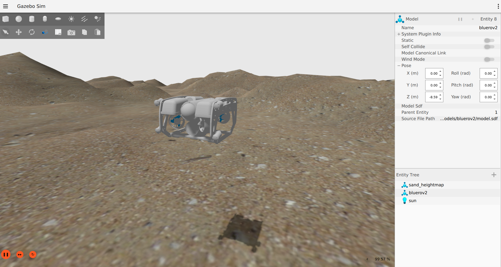

# BlueROV2 in Gazebo Garden

> Status: proof-of-concept, updated for Gazebo Garden binaries

This is a model of the BlueROV2 that runs in Gazebo Garden.
It uses the BuoyancyPlugin, HydrodynamicsPlugin and ThrusterPlugin.

## Requirements

* [Gazebo Garden 7.1.0](https://gazebosim.org/docs/garden/install)
* [ardupilot_gazebo](https://github.com/ArduPilot/ardupilot_gazebo)
* [ArduSub and MAVProxy](https://ardupilot.org/dev/docs/building-setup-linux.html)

See the [Dockerfile](docker/Dockerfile) for installation details.

## Running Gazebo

Launch Gazebo:
~~~
export GZ_SIM_RESOURCE_PATH=~/colcon_ws/src/bluerov2_ignition/models:~/colcon_ws/src/bluerov2_ignition/worlds
export GZ_SIM_SYSTEM_PLUGIN_PATH=~/ardupilot_gazebo/build
gz sim -v 3 -r underwater.world
~~~

You can directly send thrust commands to the BlueROV2 model in Gazebo:
~~~
cd ~/colcon_ws/src/bluerov2_ignition
. scripts/cw.sh
. scripts/stop.sh
~~~

Now Launch ArduSub and ardupilot_gazebo:
~~~
cd ~/ardupilot
Tools/autotest/sim_vehicle.py -L RATBeach -v ArduSub --model=JSON --out=udp:0.0.0.0:14550 --console
~~~

Use MAVProxy to send commands to ArduSub:
~~~
arm throttle
rc 3 1450     
rc 3 1500
mode alt_hold
rc 5 1550
disarm
~~~

## Caveats:
* The model needs tuning
* The visuals are quite basic

## References:
* https://github.com/ardupilot/ardupilot_gazebo/wiki
* https://gazebosim.org/docs/garden/install
* https://ardupilot.org/dev/docs/building-setup-linux.html
* https://ardupilot.org/dev/docs/setting-up-sitl-on-linux.html
* https://ardupilot.org/mavproxy/docs/getting_started/download_and_installation.html
* https://www.ardusub.com/developers/rc-input-and-output.html
* https://docs.nvidia.com/datacenter/cloud-native/container-toolkit/install-guide.html